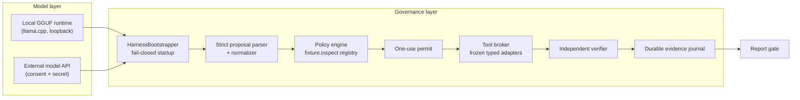

# Cyber SOP Harness

A portable governance and execution framework that puts a policy, evidence, and verification layer between any model and any security tool — for authorized defensive testing.

[](https://github.com/AnonymousNomad/cyber-sop-harness/actions/workflows/ci.yml)
[](LICENSE)
[](https://dotnet.microsoft.com/)
[](#status)
[](https://github.com/AnonymousNomad/cyber-sop-harness/actions/workflows/ci.yml)

## Why

Security teams and authorized bug-bounty researchers increasingly use LLMs to draft actions, triage findings, and explain methodology. The usual failure mode is that a convincing proposal goes straight into a terminal or API with no durable authorization check, permit, evidence chain, or independent verification. That is unsafe for operations and unusable as professional evidence.

Cyber SOP Harness puts an external control plane between a model and a tool. It converts procedures into stateful, verifiable workflows:

> The model proposes. The policy engine decides. The typed adapter executes. The evidence store records. The independent verifier validates.

The result: deterministic offline fixtures and live engagements run under the same fail-closed policy, and every step leaves durable, tamper-detectable evidence.

## Who It Is For

- Security engineers who need reproducible, evidence-backed automation.
- Authorized bug-bounty operators who must keep every action inside written scope.
- Red/blue teams that need separate model reasoning from execution authority.
- Tool authors building model-facing security workflows without giving the model unrestricted shell access.

This project is for authorized work only. It does not authorize targets, bypass scope, or turn an untrusted finding into verified proof.

## Status

**Development preview — not approved for production engagements or live-target operations.**

| Capability | Available today |
|---|---|
| Governed offline pipeline | Working Windows CLI path through policy, permit, synthetic-tool dispatch, verification, report, journal, and replay tests |
| Command desk | Fixed-verb terminal surface with doctor, status, help, model inspection, JSON mode, bounded history, sanitization, and emergency stop; Phase B views are in progress |
| Cross-platform builds | Linux/arm64 build and 40-test validation pass locally; full governed execution still requires Windows DPAPI custody today |
| Local model runtime | Manifest design, loopback boundary, and measured LFM2.5 edge benchmark exist; pinned model serving is not yet wired into the desk |
| Live security tools | Not implemented; the current adapter is explicitly synthetic |
| Production gate | No release has passed live-target containment, operator acceptance, threat-model review, and independent evidence verification |

Do not point this software at infrastructure you are not explicitly authorized to assess.

## Features

- **Model-agnostic providers** — local GGUF runtimes (llama.cpp, verified manifests, loopback-only) and remote model APIs (consent-gated, secret-stored) behind one typed `IModelProvider` surface.
- **Fail-closed bootstrap** — missing selection, tampered model, absent consent, non-loopback endpoint, or runtime readiness failure aborts startup with a controlled error.
- **Strict proposal parsing** — models return bare JSON action requests; fences and commentary are normalized away, malformed output is rejected, never guessed.
- **Frozen typed tool registry** — tools execute only through typed adapters bound by capability registry and one-use permits; no free-form shell.
- **Durable evidence** — tamper-detecting journal, signed artifact hashes, and DPAPI-protected provenance keys; recovery on restart with tamper detection.
- **Full governance workflow** — action → policy → permit → dispatch → evidence → independent verification → report, with a live-visible `run` pipeline and JSON journal.
- **No runtime bloat** — zero-dependency testable core; model weights and runtime engines are user-staged and never bundled.

## Table of Contents

- [Security](#security)
- [Who it is for](#who-it-is-for)
- [Status](#status)
- [Architecture](#architecture)
- [Install](#install)
- [Quickstart](#quickstart)
- [CLI reference](#cli-reference)
- [Configuration](#configuration)
- [Evidence and provenance](#evidence-and-provenance)
- [Tests](#tests)
- [Documentation](#documentation)
- [Contributing](#contributing)
- [License](#license)

## Security

**Authorized defensive testing only.** The harness must fail closed when authorization, scope, identity, evidence, or containment is missing or ambiguous — and it does, by design: strict manifest validation, no action without a permit, loopback-only local model connections, consent-gated external APIs, and never a degraded run.

No credentials or target data are stored in the repository. All local runtime state lives under `data/` (journal, artifacts, secrets, keys, selection) and is git-ignored.

See [SECURITY.md](SECURITY.md) for the security model and vulnerability reporting.

## Architecture



Trust boundaries: the model never talks to tools; every proposal crosses the parser, policy, permit, and broker before any tool executes, and every execution is journaled and independently verified.

## Install

Prerequisites:

- Windows 10/11 or Linux x64/arm64 for build/test and command-desk development
- [.NET 10 SDK](https://dotnet.microsoft.com/download)
- (Optional) a local GGUF model and a llama.cpp runtime build for local model serving

```powershell
git clone https://github.com/AnonymousNomad/cyber-sop-harness.git
cd cyber-sop-harness
dotnet build CyberSopHarness.slnx --configuration Release
```

Model weights and the llama.cpp engine are **user-staged, not bundled** — see [Configuration](#configuration).

Windows DPAPI currently protects provenance keys and persisted secrets. Therefore, governed runs are Windows-only today even though the core builds and the desk shell validate on Linux.

## Quickstart

Three commands to see the whole governed pipeline:

```powershell
dotnet run --project src/CyberSopHarness.App -- setup           # choose provider + model
dotnet run --project src/CyberSopHarness.App -- run --telemetry # probe + governed execution
dotnet run --project src/CyberSopHarness.App -- status          # runtime state + endpoint
```

`run` prints the live pipeline — `READY → PROBE → POLICY → PERMIT → DISPATCH → PROVENANCE → VERIFIED → REPORT → JOURNAL → STOPPED` — and persists `data/evidence.journal` plus signed artifacts under `data/artifacts/`.

### Command desk

Start the fixed-verb operations shell without enabling free-form terminal access:

```bash
dotnet run --project src/CyberSopHarness.App -- desk
```

The desk supports `action`, `doctor`, `emergency`, `engagement`, `evidence`, `exit`, `help`, `model`, `proposal`, `report`, and `status`. Use `--json` for machine-readable output, `--no-color` to disable styling explicitly, `--no-history` for ephemeral sessions, and `--command 'status\nhelp'` for scripted checks. A critical result engages emergency stop and ends the REPL.

## CLI reference

| Command | Description |
|---|---|
| `setup` | Provider/model selection wizard with full disclosure checks |
| `run [--port N] [--telemetry] [--data-dir DIR]` | Select → bootstrap → probe → governed execution → stop |
| `endpoint set <url>` / `clear` / `show` | External model endpoint custody (https any host, http loopback-only) |
| `secret set|get|clear|rotate <name>` | DPAPI-protected secret custody |
| `model list` / `info <name>` / `select <name>` | Staged model catalog and active selection |
| `status` | Selection, runtime, evidence, and endpoint state |
| `desk [options]` | Fixed-verb command shell with plain/ANSI rendering, bounded history, JSON mode, and emergency stop |

## Configuration

- **Local model** — stage a GGUF file under `models/<name>/` with a `MODEL-RUNTIME-MANIFEST.json` (see the staged-example notice in the repo) and a pinned llama.cpp build under `runtime/`. The bootstrapper verifies the manifest, binds a loopback-only provider, and waits for readiness (default 180 s budget).
- **External API** — `endpoint set <url>` (loopback http or any https) + `secret set external-api` + `setup --provider external-api --ack-egress yes`. The wizard hides the external choice until both endpoint and secret exist.
- All runtime state is scoped to `data/` and can be relocated with `run --data-dir`.

## Evidence and provenance

Every governed run produces: a `DurableEvidenceJournal` with recovery and tamper detection, raw and redacted artifacts (SHA-256 verified by an independent verifier), and an OS-DPAPI-protected `runtimeevidence` provenance key with rotation support. `run` replays the journal on restart and re-verifies recorded evidence before continuing.

## Tests

40 deterministic offline tests across three self-running suites (0 real-model opt-ins in CI):

```powershell
dotnet run --project tests/Phase2.Tests --configuration Release  # 10 tests: policy, permits, workers, job objects
dotnet run --project tests/Phase3.Tests --configuration Release  # 23 tests: providers, evidence, provenance, bootstrap
dotnet run --project tests/CommandDesk.Tests --configuration Release  # 7 tests: input, rendering, history, stop behavior
```

A real-model runtime smoke test is opt-in via `PHASE3B_REAL_MODEL=1` and never runs in CI. CI builds on Windows and Linux with warnings treated as errors, runs all 40 deterministic tests, and rejects changes that cannot meet those gates.

## Documentation

- [ARCHITECTURE.md](ARCHITECTURE.md) — cross-platform topology, trust boundaries, deployment constraints
- [RESEARCH.md](RESEARCH.md) — source-backed research, market findings, design decisions
- [ROADMAP.md](ROADMAP.md) — phases, skills, deliverables, verification gates
- [docs/](docs/) — requirements, threat model, decisions, fixtures, acceptance records
- [agent_notes.Md](agent_notes.Md) — append-only project audit

## Contributing

Contributions are welcome — see [CONTRIBUTING.md](CONTRIBUTING.md) for build/test commands, conventions, and the PR process.

## License

[MIT](LICENSE) — SPDX: `MIT`
